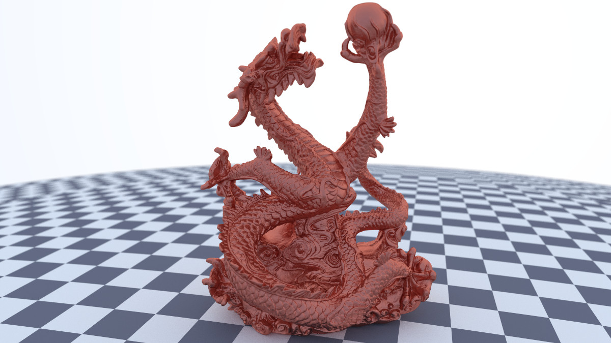

# Tracer

This is a minimal (unoptimized, feature-sparse) from-scratch implementation of a path tracer. The implementation almost all directly follows the book series
[Ray Tracing in One Weekend](https://raytracing.github.io/) by Peter Shirley, Trevor David Black, and Steve Hollasch. There are, however, a few additional
features implemented in this version (outlined below), as well as a few minor divergences in implementation and code style.



## Additional features

In addition to the features covered in the Ray Tracing in One Weekend Series, this renderer implements the following additional features:

- basic multithreading (see `src/threads.h`)
- ability to resume interrupted renders (see the interrupt handler in `src/tracer.cc`)
- additional 2D primitives (see `src/shape2d.h`)
- general affine transformations (see `src/hittable.h` and `src/linalg.h`)
- STL mesh loading (see `src/mesh.h`)
- from-scratch PPM image loading (see `src/image.h`)
- more documentation; cleaner, more generic APIs


## Compilation

The build process is orchestrated by GNU Make. The following Make targets are implemented (among others):

- `all`: default target; compile renderer
- `render`: build & render, outputting to `renders/render.ppm`
- `resume`: build & resume previously-interrupted render (which must be located at `renders/render.ppm`)
- `clean`: delete compilation artifacts & binaries

## Scenes included

Scenes are defined in `.inc` files, located in `src/scenes`. Each scene file should implement the function,
```c++
void build_scene(HittableList& scene, HittableList& lights, Camera& cam);
```
in which the scene is populated and the camera configured. The scene is then selected by including the appropriate file
in `tracer.cc`, such as
```c++
#include "scenes/01_bouncing_spheres.inc"
```

Notable scenes included in this project are

- `07_cornell_box.inc`: the classic [Cornell Box](https://en.wikipedia.org/wiki/Cornell_box) test scene
- `10_demo_render.inc`: the final render from [book 2](https://raytracing.github.io/books/RayTracingTheNextWeek.html) of the Ray Tracing in One Weekend Series
- `12_dragon.inc`: a render of a complex high-poly dragon mesh (expect about 3 days to render)

## Limitations & future expansions

Here are some features that are missing from the current implementation, which I would like to implement in the future (pull requests are welcome):

- [constructive solid geometry](http://cosinekitty.com/raytrace/chapter14_set_operations.html) (unions, intersections, etc)
- a glossy [bidirectional reflectance distribution function](https://en.wikipedia.org/wiki/Bidirectional_reflectance_distribution_function)
- a torus primitive (this is algebraically tricky; ray intersections require
  [solving a quartic](http://cosinekitty.com/raytrace/chapter13_torus.html))
- non-convex volumes
- PDFs for hittables other than spheres / parallelograms (boxes, other 2D primitives like ellipses);
  this is needed for `Camera::render` to support these hittables as `lights`
- [Metropolis light transport](https://en.wikipedia.org/wiki/Metropolis_light_transport)
- general framework for motion in scene
- PDF for sampling moving sphere
- support for image formats other than `.ppm`
- support for 3D model formats other than `.stl`

## Disclaimers

None of the models in `models` or the images in `images` are included under the license of this repository. I do not
claim ownership for any of these; they serve only as test cases for the renderer.
